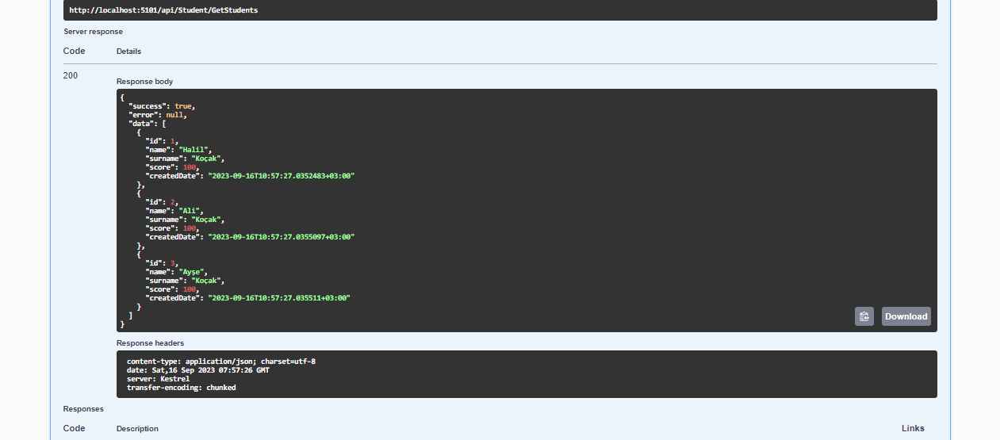

# Vakifbank Bootcamp Çalışmalar
### İlk Hafta Ödevi
- Restful Api Geliştirin
- Rest standartlarna uygun olmalıdır.
- GET,POST,PUT,DELETE,PATCH methodları kullanılmalıdır.
- Http status code standartlarına uyulmalıdır. Error Handler ile 500, 400, 404, 200, 201 hatalarının standart format ile verilmelidir. 
- Modellerde zorunlu alanların kontrolü yapılmalıdır.
- Routing kullanılmalıdır.
- Model binding işlemleri hem body den hemde query den yapılacak şekilde örneklendirilmelidir. 
**Bonus:**
- Standart crud işlemlerine ek olarak, listeleme ve sıralama işlevleride eklenmelidir. 
- Örn: /api/products/list?name=abc

--- 
#### Ekran Görüntüleri
- Methodlar :

- Örn: GetAll Methodu
